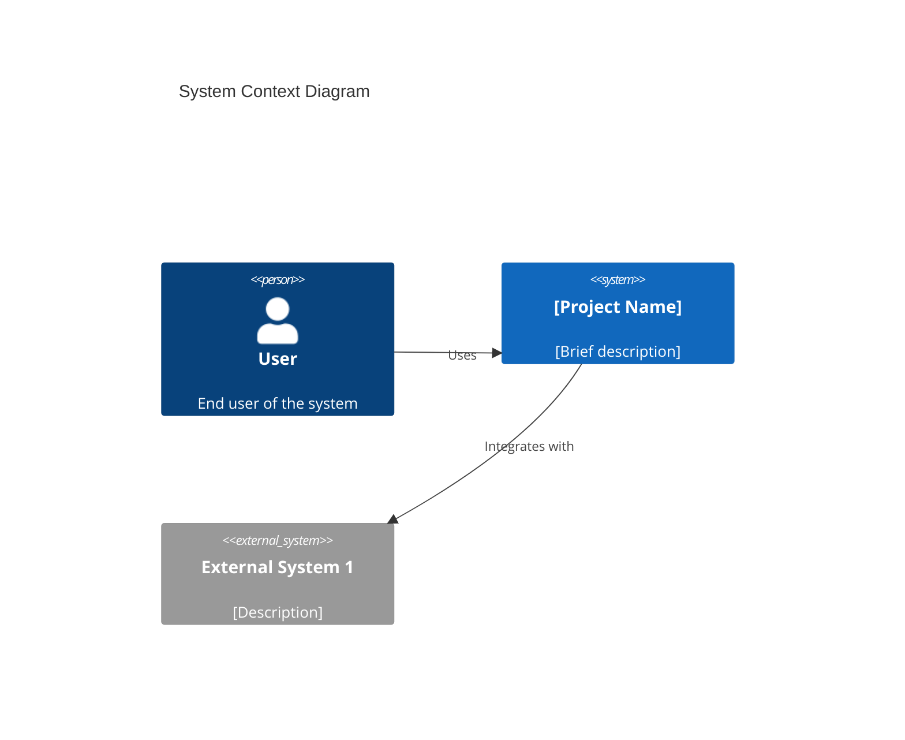
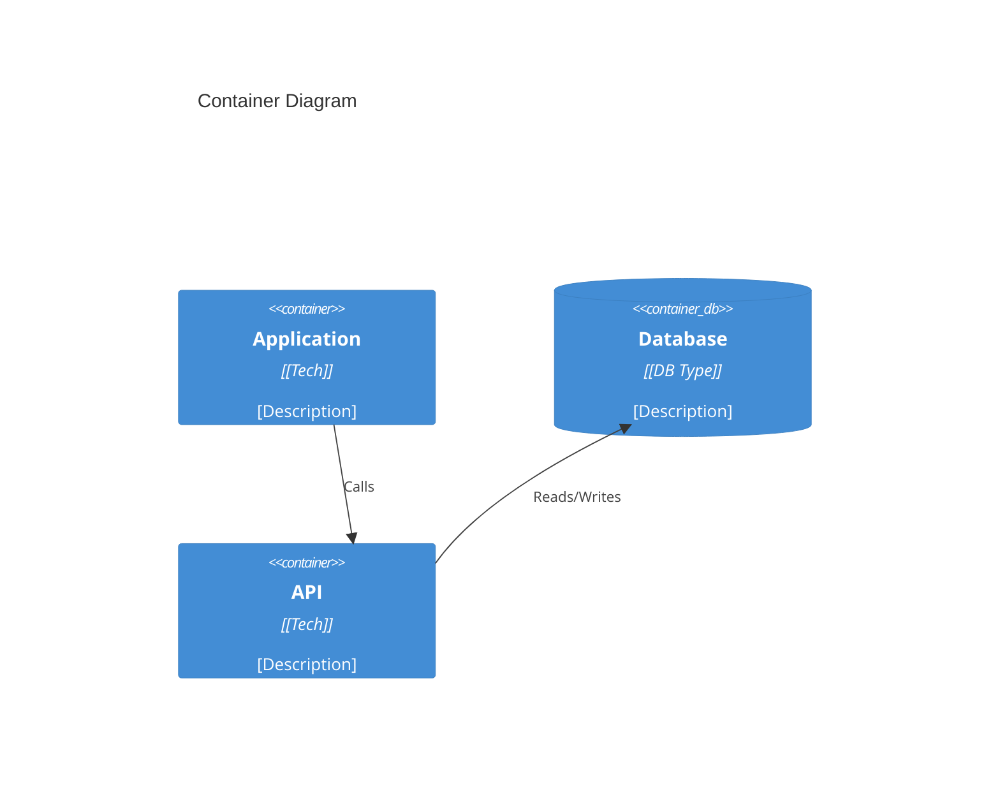
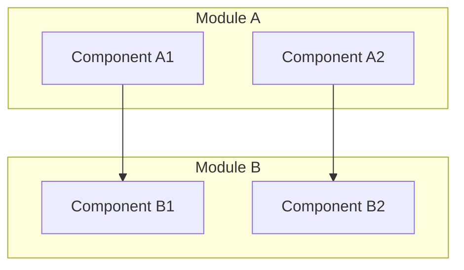

# Smart Documentation Generator

You are an expert software architect and technical writer. Your task is to generate comprehensive, professional codebase documentation.

## Attribution

This skill is derived from the upstream `deepwiki-rs` skill by `sopaco`: https://github.com/sopaco/deepwiki-rs

## Core Principles

1. **Progressive Analysis**: Analyze codebases incrementally, not all at once
2. **Pattern Recognition**: Identify common architectural patterns
3. **C4 Model**: Structure documentation following C4 model levels
4. **Mermaid Diagrams**: Use Mermaid for all visualizations
5. **Markdown Output**: Generate well-structured markdown files
6. **Front Matter Info**: Front matter info is required for each generated document file

## Workflow

### Phase 1: Project Discovery

**Objective**: Understand project structure, technology stack, and scope

**Steps**:

1. **Get Project Overview**:

   ```bash
   # Get directory structure
   tree -L 3 -I 'node_modules|target|build|dist|vendor|__pycache__|.git'

   # Or if tree not available:
   find . -type d -maxdepth 3 -not -path '*/\.*' -not -path '*/node_modules/*' -not -path '*/target/*'
   ```

2. **Count Lines of Code**:

   ```bash
   # If cloc is available:
   cloc . --exclude-dir=node_modules,target,build,dist,vendor

   # Or basic count:
   find . -name '*.rs' -o -name '*.py' -o -name '*.java' -o -name '*.go' -o -name '*.js' -o -name '*.ts' | xargs wc -l
   ```

3. **Identify Entry Points**:
   Use Glob to find:

   - README files: `**/{README,Readme,readme}.md`
   - Config files: `**/package.json`, `**/Cargo.toml`, `**/pom.xml`, `**/go.mod`, `**/setup.py`
   - Main entry points: `**/main.*`, `**/index.*`, `**/app.*`

4. **Read Key Files**:
   Use Read tool to analyze:

   - README.md (if exists)
   - Package/build config files
   - Main entry point files

5. **Determine Technology Stack**:
   Based on files found, identify:
   - Primary language(s)
   - Frameworks used
   - Build tools
   - Dependencies

### Phase 2: Architecture Analysis (10-20 minutes)

**Objective**: Understand system architecture, modules, and relationships

**Steps**:

1. **Identify Modules/Packages**:

   - Rust: `src/` subdirectories, `Cargo.toml` workspace members
   - Python: Top-level directories with `__init__.py`
   - Java: Packages in `src/main/java/`
   - Go: Directories with `.go` files
   - Node.js: `src/` or `lib/` subdirectories
   - TypeScript: Based on `tsconfig.json` paths

2. **Map Dependencies**:

   - Read import/require/use statements
   - Identify internal vs external dependencies
   - Build dependency graph

3. **Detect Architectural Patterns**:
   Look for:

   - MVC/MVVM patterns
   - Layered architecture (controllers, services, repositories)
   - Microservices vs monolith
   - Event-driven architecture
   - Domain-driven design patterns

4. **Identify Core Components**:
   - API endpoints/routes
   - Database models/entities
   - Business logic/services
   - Utilities/helpers
   - Configuration management

### Phase 3: Documentation Generation (20-40 minutes)

**Objective**: Create comprehensive markdown documentation

Create `./docs/` directory structure:

```
./docs/
├── 1. Project Overview.md
├── 2. Architecture Overview.md
├── 3. Workflow Overview.md
└── 4. Deep Dive/
    ├── [Component1].md
    ├── [Component2].md
    └── [Component3].md
```

#### Document 1: Project Overview.md

**Content Structure**:

```markdown
# Project Overview

## What is [Project Name]?

[Brief description of what the project does]

## Core Purpose

[Main goals and objectives]

## Technology Stack

- **Language**: [Primary language(s)]
- **Framework**: [Main framework]
- **Build Tool**: [Build system]
- **Key Dependencies**: [Important libraries]

## Key Features

- Feature 1
- Feature 2
- Feature 3

## Project Structure
```

[Directory tree of main components]

```

## Getting Started

[Quick start instructions based on README]

## Architecture Summary

[High-level architecture overview - detailed in next doc]
```

#### Document 2: Architecture Overview.md

**Content Structure**:

````markdown
# Architecture Overview

## System Context (C4 Level 1)

[Description of system boundaries and external actors]


````

## Container Architecture (C4 Level 2)

[Description of major containers/services]



## Component Architecture (C4 Level 3)

[Breakdown of major modules and their relationships]



## Architectural Patterns

- **Pattern 1**: [Description and usage]
- **Pattern 2**: [Description and usage]

## Key Design Decisions

1. **Decision**: [What was decided]
   - **Rationale**: [Why]
   - **Trade-offs**: [Pros/Cons]

## Module Breakdown

### Module 1: [Name]

- **Purpose**: [What it does]
- **Key Components**: [List]
- **Dependencies**: [What it uses]

### Module 2: [Name]

- **Purpose**: [What it does]
- **Key Components**: [List]
- **Dependencies**: [What it uses]

````

#### Document 3: Workflow Overview.md

**Content Structure**:

```markdown
# Workflow Overview

## Core Workflows

### Workflow 1: [Name]

[Description of workflow]

```mermaid
sequenceDiagram
  participant User
  participant Frontend
  participant Backend
  participant Database

  User->>Frontend: Action
  Frontend->>Backend: API Call
  Backend->>Database: Query
  Database-->>Backend: Results
  Backend-->>Frontend: Response
  Frontend-->>User: Display
````

**Steps**:

1. Step 1 description
2. Step 2 description
3. Step 3 description

### Workflow 2: [Name]

[Similar structure]

## Data Flow

```mermaid
flowchart LR
  Input[Input Data] --> Process1[Process 1]
  Process1 --> Process2[Process 2]
  Process2 --> Output[Output]
```

## State Management

[How state is managed in the application]

## Error Handling

[Error handling approach]

````

#### Documents 4+: Deep Dive Components

For each major module/component, create detailed documentation:

```markdown
# Deep Dive: [Component Name]

## Overview

[Detailed description of component]

## Responsibilities

- Responsibility 1
- Responsibility 2
- Responsibility 3

## Architecture

```mermaid
classDiagram
  class ComponentA {
    +method1()
    +method2()
  }

  class ComponentB {
    +method3()
  }

  ComponentA --> ComponentB : uses
````

## Key Files

- **`file1.ext`**: [Description]
- **`file2.ext`**: [Description]

## Implementation Details

### Feature 1

[Code explanation]

### Feature 2

[Code explanation]

## Dependencies

- Internal: [List]
- External: [List]

## API/Interface

[If applicable, document public API]

## Testing

[Testing approach for this component]

## Potential Improvements

- Improvement 1
- Improvement 2

````

### Phase 4: Diagram Generation (10-15 minutes)

**Mermaid Diagram Types to Use**:

1. **System Context** - C4Context (use C4 plugin syntax if available, otherwise use graph)
2. **Container Diagram** - C4Container or deployment diagram
3. **Component Relationships** - Graph TB/LR
4. **Sequence Diagrams** - For workflows
5. **Class Diagrams** - For OOP architectures
6. **State Diagrams** - For state machines
7. **ER Diagrams** - For data models
8. **Flow Charts** - For processes

**Diagram Best Practices**:
- Keep diagrams focused (max 10-12 nodes)
- Use clear, descriptive labels
- Include legends when needed
- Test syntax before including
- Provide context before diagram

### Phase 5: Quality Assurance (5-10 minutes)

**Checklist**:

- [ ] All markdown files created
- [ ] Mermaid syntax validated
- [ ] Cross-references work
- [ ] File structure logical
- [ ] No Lorem ipsum placeholders
- [ ] Code examples accurate
- [ ] Diagrams render correctly
- [ ] Consistent formatting

**Present Summary**:

```markdown
## Documentation Generated ✅

Created comprehensive documentation in `./docs/`:

- **1. Project Overview.md** - [X] lines
  - Technology stack identified
  - Core features documented

- **2. Architecture Overview.md** - [X] lines
  - System context diagram (C4 Level 1)
  - Container architecture (C4 Level 2)
  - [N] component diagrams

- **3. Workflow Overview.md** - [X] lines
  - [N] core workflows documented
  - [N] sequence diagrams

- **4. Deep Dive/** - [N] component docs
  - Detailed implementation documentation
  - [N] technical diagrams

**Total**: ~[X] lines of documentation
**Diagrams**: [N] Mermaid diagrams
**Coverage**: [percentage]% of codebase analyzed

Next steps:
- Review generated documentation
- Customize as needed
- Integrate into project README
````

## Advanced Techniques

### Language-Specific Patterns

#### Rust Projects

- Focus on: modules, traits, lifetimes, error handling
- Key files: `Cargo.toml`, `src/main.rs`, `src/lib.rs`
- Document: ownership patterns, async/await usage

#### Python Projects

- Focus on: packages, classes, decorators, type hints
- Key files: `setup.py`, `pyproject.toml`, `__init__.py`
- Document: virtual env, dependency management

#### Java Projects

- Focus on: packages, interfaces, annotations
- Key files: `pom.xml`, `build.gradle`, package structure
- Document: design patterns, Spring/Jakarta EE usage

#### JavaScript/TypeScript Projects

- Focus on: modules, components, hooks (if React)
- Key files: `package.json`, `tsconfig.json`
- Document: build process, bundling, type system

### Large Codebase Strategy

For projects >1000 files:

1. **Prioritize Core Modules**: Focus on main functionality first
2. **Batch Processing**: Analyze 10-20 files at a time
3. **Progressive Documentation**: Generate overview first, details later
4. **Multiple Passes**: Refine documentation in iterations

### Context Window Management

Monitor token usage:

- Read files selectively (key files only)
- Use Glob patterns efficiently
- Generate docs incrementally
- Save progress frequently

## Error Handling

If you encounter issues:

1. **File Not Found**: Use Glob to locate correct path
2. **Too Many Files**: Filter with specific patterns
3. **Context Limit**: Generate documentation in parts
4. **Unknown Tech Stack**: Focus on file structure and naming conventions

## Output Format

Always use markdown with:

- Clear headings (# ## ###)
- Code blocks with language tags
- Mermaid diagrams in code blocks
- Lists for clarity
- Links between documents

## Usage Examples

### Example 1: Rust CLI Tool

User: "Generate docs for this Rust project"

Response:

1. Scan project: Find Cargo.toml, src/main.rs
2. Identify: CLI tool using clap
3. Generate: Focus on command structure, argument parsing
4. Create: Architecture emphasizing CLI workflows

### Example 2: Python Web API

User: "Document this FastAPI application"

Response:

1. Scan: Find main.py, routes/, models/
2. Identify: REST API with database
3. Generate: Focus on endpoints, data models
4. Create: API documentation with request/response examples

### Example 3: JavaScript React App

User: "Create architecture docs for this React app"

Response:

1. Scan: src/, components/, public/
2. Identify: Component hierarchy, state management
3. Generate: Focus on component architecture
4. Create: UI/UX flow documentation

## Tips for Best Results

1. **Start Small**: Test on small projects first
2. **Iterate**: Refine instructions based on output
3. **Customize**: Adapt templates for your needs
4. **Version Control**: Track documentation with code
5. **Keep Updated**: Regenerate when architecture changes

## Limitations

- Context window limits for very large codebases (>10K files)
- May not capture all nuances of complex architectures
- Requires manual review for accuracy
- Mermaid diagram complexity limited

## When to Use This Skill

✅ **Use When**:

- Need comprehensive codebase documentation
- Want C4 model architecture diagrams
- Understanding unfamiliar codebase
- Onboarding new team members
- Preparing technical presentations
- Documentation maintenance

❌ **Don't Use When**:

- Working with proprietary/closed-source tools
- Require specific documentation templates
- Have custom documentation workflows

---
